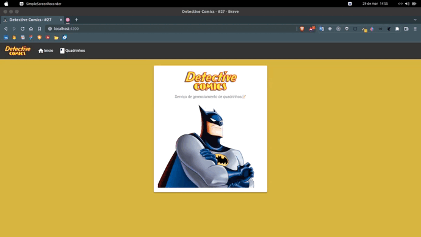

# Detective Comics 📜

## ⚠ Uma nova versão do backend foi feita em Java Spring Boot! Caso queira executar o front end com a versão do backend em Node.js, é necessário alterar os endpoints no serviço. ⚠

__Serviço de gerenciamento de quadrinhos feito com Angular, Node, Express e SQL(MariaDB)📦__

<a href="https://youtu.be/_wNw2O1UCDA">Detective Comics - Vídeo de demonstração</a>

<div>
  
</div>

#### **Tecnologias utilizadas 🛠️**

- Front-end 🏠
  * AngularJS
  * Angular Material
  * SCSS
- Back-end 💾
  * NodeJS e Java Spring
- Banco de Dados
  * MariaDB e Postgres

---
### **Documentação 📝**

Infelizmente não encontrei nenhum serviço para hospedar o banco de dados gratuitamente.⚠️

---
### **Criação do banco de dados e configuração📦**

Para configurar o banco de dados, vamos utilizar o Docker! Você pode instalar o Docker no site oficial
e seguir a documentação para instalá-lo em sua máquina.

Edite o arquivo Dockerfile para inserir seu usuário e senha..

O SGBD utilizado para esse projeto foi o **MariaDB**

Com o docker instalado, baixar rodar o seguinte comando:

#### *Código*
```bash
npm run docker-config
npm run docker-run
```

Caso esteja executando o backend com Java, use os seguintes comandos:

```bash
docker build -t detective-comics-postgres .
docker run -d -p 3306:3306 --name detective_comics_db detective-comics-postgres
```

Em ```./backend/src/models/pool.ts``` é preciso configura o **user** e **password** do seu usuário.
*Recomendado utilizar variáveis de Ambiente*

---
### **Instalação de dependências📦**

```bash
# Entra na pasta do projeto
$ cd detective-comics-main

# Entra na pasta do backend
$ cd backend

# Instalar todos os pacotes necessários
$ npm install

# Rodar o projeto
npm start

# -- Em outro terminal ⚠️ --

# Entra na pasta do fronend
$ cd fronend

# Instalar todos os pacotes necessários
$ npm install

# Rodar o projeto
npm start

```

---
**Portas utilizadas no projeto🚪**
* Front-end: 4200

---
#### **Projeto desenvolvido por [Matheus Henrique da Silva]("https://www.instagram.com/themateusreal/")🚀👨‍🚀👨🏿‍💻**